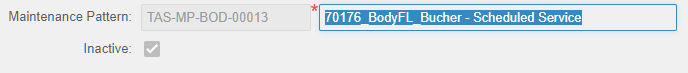
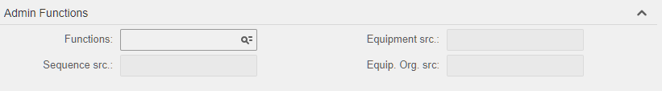

[](./)

# Maintenance Pattern

## Inactive field
Natively, inactive field is not available on MP record view. The active status of a MP seems to be driven by the status of the associated MP equipment i.e. if the MP equipment status is active we can say that the MP is active as well.

Design wise this is inconsistent when compared to another scheduler module (PM Schedules)
| Screen | Tab | Inactive |
| :--- | :--- | :---: |
| Maintenance Pattern | Record View | :black_large_square: |
| Maintenance Pattern | Equipment | :ballot_box_with_check: |
| PM Schedules | Record View | :ballot_box_with_check:	|
| PM Schedules | Equipment | :black_large_square: |

In order to identify whether an MP has an active equipment, users would need to check the MP equipment tab of each MPs. This can be daunting when dealing with thousands of MP records.

### Specification
- MP record view to display status of MP equipment via a field called ***Inactive***
  - [x] mtp_udfchkbox04 to be use
- The field should be a flag type (boolean type) to indicate the MP is active or not
- The field to be protected since it is logical value determined by the MP equipment status
  - [x] [EXF WSMPAT_HDR_01](./EXF/WSMPAT_EXT_HDR_01.js)
- Field logic:
  - Inactive :white_check_mark:
    - no MP equipment exist
      - [x] [Flex R5MAINTENANCEPATTERN/5/Insert](./FLEX/R5MAINTENANCEPATTERNS/005_Insert.sql)
    - all MP equipment status inactive
      - [x] [Flex R5PATTERNEQUIPMENT/20/Insert](./FLEX/R5PATTERNEQUIPMENT/020_Insert.sql)
      - [x] [Flex R5PATTERNEQUIPMENT/20/Update](./FLEX/R5PATTERNEQUIPMENT/020_Update.sql)
  - Inactive :green_square:
    - one or more MP equipment status is not inactive
    

  
## MP Functions
The MP module was identified to be a candidate to manage meter-based maintenance schedule due to it's ability to handle complex maintenace strategies. Natively, the EAM only allows fixed or variable types for meter-based WOs. This poses some risk when dealing with high frequency meter plans as it requires WO to be closed prior to relasing the one. To overcome this, we have deployed some flexes to allow systematic release of the next WO so that it would not be impacted by Business planning.

To manage these non-native features, the ability to maintained the module via Web is highly desired.

### Specification
- Section to host maintenance function on MP record view
  - [x] rename udfsection to Admin Functions
- Fields associated:
  - [x] mtp_udfchar02, ***Functions*** - selection administration function to perform
    - RSET, [Restart MP](#restart-mp)
    - CLMP, Clear MP sequence
    - CPMP, Copy MP sequence
  - [x] mtp_udfchar03, ***Sequence src.*** - lookup for MP sequence to copy; disabled by default, editable when CPMP function selected
  - [x] mtp_udfchar04, ***Equipment src.*** - lookup for MP equipment to restart; disabled by default, editable when RSET function selected
  - [x] mtp_udfchar05, ***Equip. Org. src.*** - lookup for MP equipment org to restart; disabled by default, editable when RSET function selected
  - [x] [EXF WSMPAT_HDR_02](./EXF/WSMPAT_EXT_HDR_02.js)
    

  
#### Restart MP
Since the WO generated is mostly fixed type, when changes occurs (i.e. meter reset, changing maintenance strategies);  all open WO needed to be closed out prior to deploying changes. Tracking and waiting for the WO to be closed out can be difficult and in a lot cases administrators lost track of it. Best is to put forward the changes without waiting for the WO to be close.
- [x] Activated when Function field is populated with RSET
- [x] For MP with multiple equipment, Equipment src. and Equip. Org. src. is required. (selective restart) 
- [x] [Flex R5MAINTENANCEPATTERNS/25/Update](./FLEX/R5MAINTENANCEPATTERNS/025_Update.sql)

#### Clear MP Sequence
In some instance, maintenance strategies needed to be revised. To change the MP sequence, the active equipment needed to be deactivated first followed by changes in the sequence which can involve removing the entire sequence list. 
- [x] Activated when Function field is populated with CLMP
- [x] Stop if there's any active equipment
- [x] Mark inactive for referenced sequence and remove the rest
- [x] [Flex R5MAINTENANCEPATTERNS/30/Update](./FLEX/R5MAINTENANCEPATTERNS/030_Update.sql)

#### Copy MP Sequence
Although EAM does came with built-in ```Copy MP``` function, we found that the copied MP's sequence do not matches with the source MP . This is not idle if the reason for copying another MP is to copy their sequence. Some MP sequence's can be very long and copying from a another helps with the administration process. 
- [x] Activated when Function field is populated with CPMP
- [x] Sequence src. is require
- [x] Stop if there's any active equipment
- [x] Reformat copied sequence according to the setup of called MP
- [x] [Flex R5MAINTENANCEPATTERNS/30/Update](./FLEX/R5MAINTENANCEPATTERNS/030_Update.sql)
